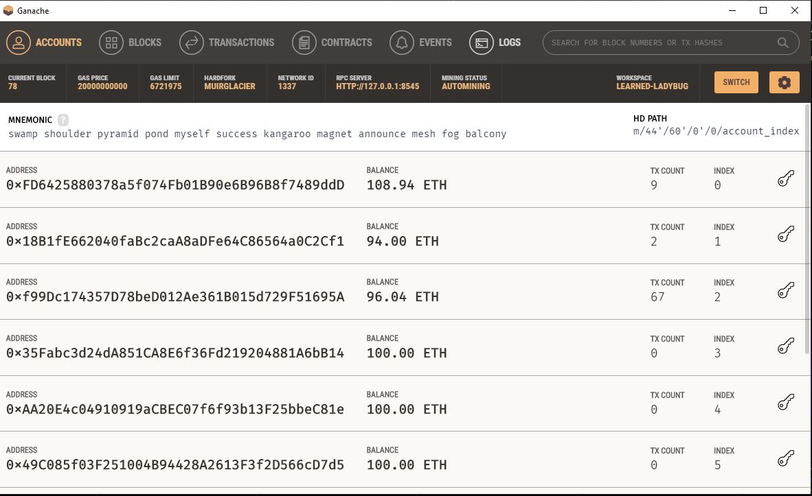
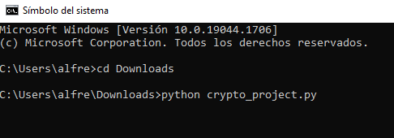
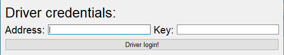
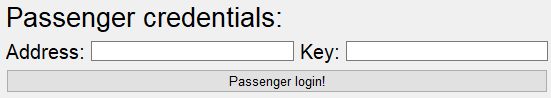
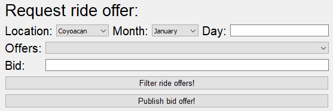
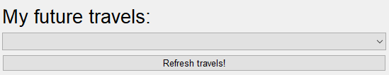
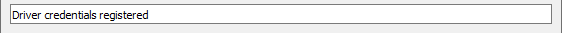
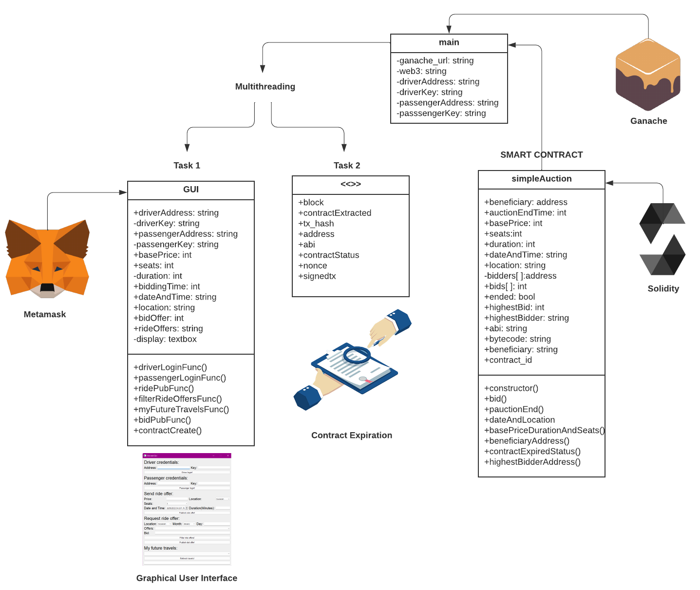
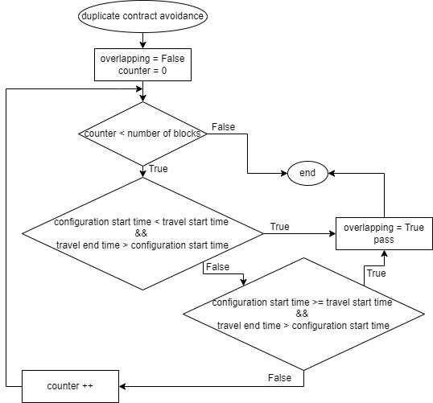
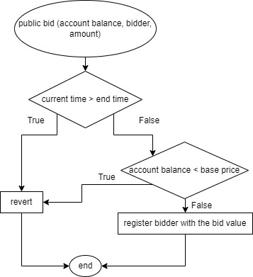

# Bid and Go

 
-----------------

## Authors(Code Breakers)

| Name  | LinkedIn                                                                                                                                                                                    |
| ------- | -------------------------------------------------------------------------------------------------------------------------------------------------------------------------------------------- |
|Alfredo Zhu Chen | [https://www.linkedin.com/in/alfredo-zhu-chen/](https://www.linkedin.com/in/alfredo-zhu-chen/) |
| Juan Pablo Valverde López | [https://www.linkedin.com/in/jpvalverdelopez/](https://www.linkedin.com/in/jpvalverdelopez)   |
| Miguel Alejandro Cruz Banda | [https://www.linkedin.com/in/miguel-alejandro-cruz-banda-085675228/](https://www.linkedin.com/in/miguel-alejandro-cruz-banda-085675228/)|

## 1. Requirements
Consider the following requirements for the application:

***Python version***:

    v.3.9.1
Install these libraries using `pip install` in the command prompt. In case there are problems in the recognition of the library, try using `pip3 install`: 
    
***Libraries***:

[**PyQt5:**](https://pypi.org/project/PyQt5/) python binding of the cross-platfrom GUI toolkit Qt

`pip install pyqt5`

[**DateTime:**](https://pypi.org/project/DateTime/) time management of the system, provides datetime datatype

`pip install DateTime`

[**Web3:**](https://pypi.org/project/web3/) library for blockchain technology

`pip install web3`

You might encounter some issues during the installation of the web3 library, if that's case review this link: https://github.com/ethereum/web3.py/issues/1578

[**solcx:**](https://pypi.org/project/py-solc-x/) python wrapper and version management tool for the Solidity Compiler

`pip install py-solc-x`

[**Ganache:**](https://pypi.org/project/py-solc-x/)

	
## 2. How to run the code
You can run the program on either Microsoft Visual Studio, an IDE(Integrated Development Environment), on the command prompt, double clicking on the file of the project with ".py extension" or directly on the python IDLE(Integrated Development and Learning Environment). Here, we show how to run the program on the command prompt and using the python IDLE.

**Running the program using the command prompt**

**Running the program using the python IDLE**

## 3. The GUI(Graphical User Interface)
**Driver Credentials**

In the first part of the GUI, the driver has to type his account address and private key in order to create contracts, make transactions or any blockchain operation. In this part is used the digital wallet to administrate the credentials, so the user don´t have to remember the characters of his account. For the wallet, Metamask is used and its functioning will be explained later. Once the fields are filled, the driver has to login with the button "Driver login!".

**Passenger Credentials**

The same way as the past section, here the passanger has to enter his account address and private key to firm contracts and make transactions. For the passenger is also used the wallet with Metamask. Once the fields are filled, the passenger has to login with the button "Passenger login!".

**Send Ride offer**

As a driver, you will want to create ride offers, so the section of "Send Ride Offer" has to be fulfilled. First you have to stablish the minimum price of the ride by just typing the amount. Then, select how many seats do you have to offer for the ride in the "Seats" section. The location is very imporant, because the people will look up for a ride that suits them the best, so you have to select the destination of your ride. Also is important for users to define the date and time that you will start your ride. And finally estimate how long is the ride going to last. This will help the application to limitate the rider to only have one ride at a time. Then publish the offer with the button below.

**Request ride offer**

As a passenger, you can search for rides that fits you the best with the filters of Location, Month and Day by just searching there. For location and month there is a combo box where the passenger can filter the rides and for the day you have to type it, and just filter the ride offers with the button below. According to the filters, the offers found can be seen as a list in the combo box of "Offers", where the passenger can select the one he/she wants. And then the only field missing would be the "Bid" field, where the passenger will offer money to take the ride. For request your ride you have to select everything and publish your offer with the button.

**My future travels**

For passenger convenience, a functionality was added where you can check your future trips, which have already been signed by the passenger. They are displayed in a combo box and to refresh the trips tab, just press the button "Refresh travels!"

**Display**

The display, located at the bottom of the GUI, is used for showing messages to the user to have a better understanding of what is happenning in the program, to confirm that a ride offer was correctly published, a bid was correctly done or even just for showing that the passenger or driver have logged in correctly.

## 5. Important features:
**UML of the project**

**Duplicate reservations avoidance**

	t1_start=datetime.strptime(dateAndLocation[0].replace('. ', '').replace('.', ''), '%d/%m/%Y %I:%M %p')#Start time of ride from contract#
	t1_end=t1_start+timedelta(minutes=int(basePriceDurationAndSeats[1])) #End time of ride from contract
	t2_start=rideTime#Start time of ride from settings
	t2_end=t2_start+timedelta(minutes=int(currentDuration))#End time of ride from settings
	if((t2_start<t1_start and t2_end>t1_start) or (t2_start>=t1_start and t2_start<t1_end)):
		overlapping=True
		pass    

**Contract expiration**

	function auctionEnd()public {
        if (block.timestamp < auctionEndTime){
            revert("Auction has not ended yet");
        }
        if (ended){
            revert("Function auctionEnded has already been called");
        }
        ended = true;
        uint j;
        for(j=0;j<10;j++){
           if(highestBid<bids[j]){
               highestBid = bids[j];
               highestBidder = bidders[j];
           }
       }
        emit auctionEnded(highestBidder, highestBid);
        //beneficiary.transfer(highestBid);
        // send will returns false if it fails and transfer does not do anything, the code will stop there (throw)
    }
**Sufficient funds checking**

    function bid (uint _account_balance, address _bidder, uint _amount) public{
        if (block.timestamp > auctionEndTime){
            //revert("Auction has already ended");
        }
        if (_account_balance< basePrice){
            //revert("You don't have sufficient funds to carry out the reservation");
            //emit fundInsufficient(basePrice,_account_balance);
        }
        if (_amount <= bids[i]){
            //revert("There is a higher or equal bid");
        }
        if (bids[i] != 0){
            pendingReturns[bidders[i]] += bids[i];
            
        }
        bidders[i] = _bidder;
        bids[i] = _amount;
        i++;
        emit highestBidIncrease(_bidder, _amount);
    }
**Metamask**

## 4. The presentation

## 5. The video

https://youtu.be/1Ie8fk7cnVg
 
